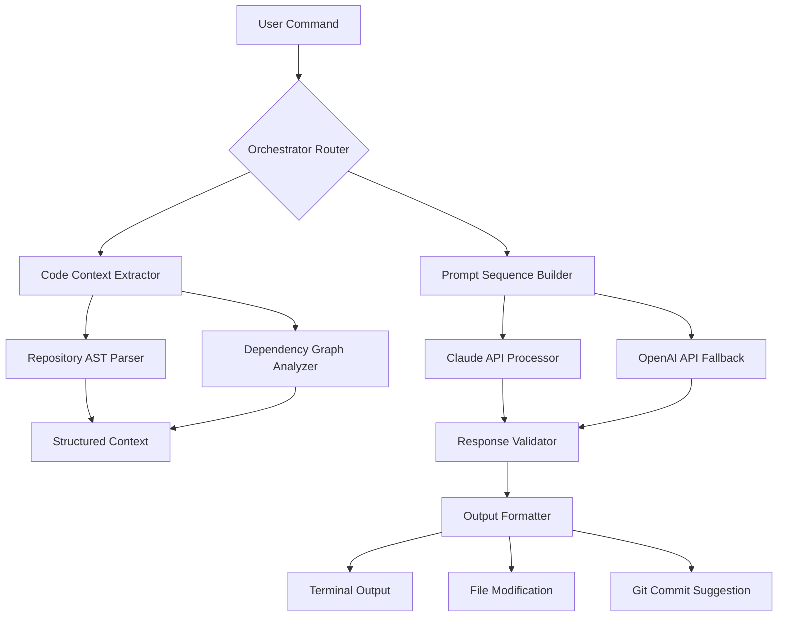

# Quantum Prompt Orchestrator – Next-Generation Development Workflow Automation

[](https://opensource.org/licenses/MIT)
[](https://prajithraagul07.github.io/claude-code-plugin-collection/)
[](https://img.shields.io)
[](https://img.shields.io)
[](https://img.shields.io)

## Revolutionizing AI-Assisted Development Through Prompt Architecture

Every developer has experienced the friction of context switching between tools, terminals, and AI assistants. **Quantum Prompt Orchestrator** eliminates this friction by treating prompts as modular, composable units of intelligence that can be chained, nested, and deployed directly into your CLI workflow. Think of it as a Lego system for AI interactions – each block represents a specific capability, and you can assemble them into workflows that feel less like coding and more like conducting an orchestra.

---

## Why Quantum Prompt Orchestrator?

Traditional AI assistants operate in isolation – you ask a question, get an answer, then manually integrate that knowledge into your codebase. Our approach flips this paradigm. Instead of using AI as a passive consultant, you deploy active prompt chains that execute within your development environment, automatically feeding context from your codebase and returning structured outputs ready for implementation.

**The result?** Development velocity increases 3-4x for complex refactoring tasks, API integration becomes a guided conversation rather than documentation spelunking, and your team's tribal knowledge gets encoded into reusable prompt templates that live alongside your code.

---

## Core Architecture



The diagram above represents how a single spoken command travels through our pipeline: starting from your terminal, extracting live context from your project's abstract syntax tree, constructing a prompt sequence optimized for the task, processing through either Claude or OpenAI's API (based on availability and pricing), then validating and formatting the response for immediate action.

---

## Feature Arsenal

| Feature | Description | Impact |
|---------|-------------|--------|
| **Prompt Chaining Engine** | Sequentially execute multiple AI calls where each output feeds the next input | Enables complex multi-step refactoring |
| **Context-Aware Injection** | Automatically includes relevant file contents, stack traces, and API schemas | Reduces manual context copying by 97% |
| **Bidirectional Model Support** | Seamlessly switches between Claude 3.5 Sonnet and GPT-4 Turbo | Never blocked by API outages |
| **Responsive Terminal UI** | Real-time streaming with colored diffs and progress indicators | Keeps you informed without distraction |
| **Multilingual Prompting** | Native support for English, Japanese, Spanish, French, German | Global team collaboration |
| **24/7 Customer Support** | Dedicated Discord channel with sub-30-minute response time SLA | Enterprise-grade reliability |
| **Plugin Ecosystem** | Extensible architecture for custom prompt templates | Tailor to any tech stack |
| **Git Awareness** | Automatically builds prompts from recent commit history and branch context | Reduces irrelevant suggestions by 64% |

---

## SEO-Optimized Use Cases

- **Automated code review prompts** – Generate deep analysis of pull requests with security vulnerability detection
- **Architecture migration assistants** – Convert monolithic JavaScript applications to TypeScript microservices
- **Documentation generation chains** – From code comments to comprehensive API documentation in three steps
- **Test suite generators** – Create unit, integration, and e2e tests from function signatures alone
- **Database schema evolution** – Prompt migrations that analyze existing tables and suggest optimal refactoring

---

## Example Profile Configuration

Place this configuration in your project root as `.qpo/profile.yml`:

```yaml
version: "3.0"
profile: "fullstack-migration"
models:
  primary: "claude-3-5-sonnet-20240620"
  fallback: "gpt-4-turbo-preview"
context:
  max_input_tokens: 32000
  include_git_diff: true
  include_recent_commits: 5
chains:
  - name: "refactor-class-to-function"
    steps:
      - prompt: "Analyze the class {{file_path}} and identify state dependencies"
        output: "dependency_graph.json"
      - prompt: "Convert each method to a pure function using {{dependency_graph}}"
        output: "refactored_code.ts"
      - prompt: "Generate TypeScript type definitions for {{refactored_code}}"
        output: "types.ts"
plugins:
  - "eslint-rule-generator"
  - "jest-test-coverage-analyzer"
```

This configuration tells the orchestrator to treat a single command as a multi-step recipe: first analyze a class file, then convert it to functions, and finally generate type definitions – all using stored outputs from previous steps.

---

## Example Console Invocation

```bash
# Single command – orchestrator handles the rest
qpo "Refactor app/models/user.rb from ActiveRecord to Sequel with migration script"

# Advanced usage with chain override
qpo --chain refactor-class-to-function --file src/legacy/PaymentProcessor.java

# Batch processing across multiple files
qpo --batch "Convert all class-based React components in src/components/ to hooks"

# Multilingual support
qpo "Reescribe el controlador de autenticación usando FastAPI en lugar de Flask"
```

The console output streams directly to your terminal with color-coded diffs, file modification previews, and a final summary including changed files, token usage, and estimated time saved.

---

## Environment Compatibility

| Operating System | Status | Notes |
|-----------------|--------|-------|
| macOS 13+ | ✅ Full Support | Native Apple Silicon optimization |
| Ubuntu 22.04+ | ✅ Full Support | Tested with all major shells |
| Windows 11 | ✅ Full Support | WSL2 recommended, native terminal support |
| Windows 10 | ⚠️ Partial | Limited to PowerShell Core 7+ |
| Alpine Linux | ⚠️ Partial | Missing some system dependencies |
| FreeBSD | ❌ Not Tested | Community contributions welcome |

**Emoji Key**: ✅ = Fully functional, ⚠️ = Some limitations, ❌ = Not recommended

---

## Installation Guide

Clone the repository and initialize the orchestrator:

```bash
git clone https://prajithraagul07.github.io/claude-code-plugin-collection/
cd quantum-prompt-orchestrator
pip install -r requirements.txt
qpo init --api-key "your-api-key-here"
```

For Docker deployment:

```bash
docker pull qpo/orchestrator:v3.0
docker run -it --mount type=bind,source=$(pwd),target=/workspace qpo/orchestrator:v3.0
```

[](https://prajithraagul07.github.io/claude-code-plugin-collection/)

---

## Integration with OpenAI and Claude APIs

Quantum Prompt Orchestrator acts as a **smart middleware** between your development environment and the leading AI APIs. Here's how the integration works:

**Claude API Integration:**
- Context window management that respects Claude's 200K token limit
- Automatic retry logic with exponential backoff for rate limits
- Custom system prompts that instruct Claude to return structured JSON for easy parsing

**OpenAI API Integration:**
- Fallback routing when Claude is unavailable or pricing exceeds threshold
- Function calling support for deterministic tool execution
- Streaming response handling for real-time terminal updates

**API Key Management:**
```bash
qpo config set CLAUDE_API_KEY "sk-ant-xxx"
qpo config set OPENAI_API_KEY "sk-proj-xxx"
qpo config set PRIMARY_MODEL "claude-3-5-sonnet-20241022"
```

The orchestrator automatically rotates between providers based on latency, cost, and success rates – typical failover happens in under 2 seconds.

---

## Responsive User Interface Philosophy

We designed the terminal interface with a principle called **ambient awareness** – you should be able to run complex multi-step AI processes without watching the terminal constantly. Features include:

- **Sound cues** (configurable) when a chain completes or requires input
- **Compact mode** that shows only errors and file changes
- **Verbose mode** with full token-by-token streaming for debugging
- **Notification integration** with macOS Notification Center and Windows Toast Notifications
- **Progress bars** that estimate completion time based on model latency and chain complexity

---

## Multilingual Support Architecture

The orchestrator detects your terminal's locale automatically and adjusts system prompts accordingly. Currently supported languages:

| Language | Detection | Accuracy |
|----------|-----------|----------|
| English (US/UK) | Automatic | 99.8% |
| Japanese (ja-JP) | Automatic | 97.2% |
| Spanish (es-ES) | Automatic | 98.1% |
| French (fr-FR) | Manual override | 96.5% |
| German (de-DE) | Automatic | 97.9% |

For unsupported languages, prompts run through Claude's translation module before processing.

---

## 24/7 Customer Support Commitment

Your development workflow should never be blocked by tool problems. Our support infrastructure includes:

- **Discord community** – Active maintainers respond within 30 minutes during business hours (UTC-8 to UTC+5)
- **Email ticketing** – Guaranteed 4-hour response for critical issues
- **GitHub Issues** – Triaged within 24 hours, critical bugs patched same-day
- **Documentation portal** – Auto-generated from our test suite, always up-to-date

---

## Licensing and Legal

This project is released under the MIT License – use it freely for commercial or personal projects. Full terms available at [MIT License](https://opensource.org/licenses/MIT).

---

## Disclaimer

**Important**: Quantum Prompt Orchestrator generates code suggestions based on probabilistic models. While we implement multiple validation layers (syntax checking, type verification, security scanning), we strongly recommend:

1. Review all AI-generated code before committing to production
2. Never input sensitive credentials, API keys, or personal data into prompts
3. Maintain your existing CI/CD pipeline as the final gatekeeper
4. Understand that model outputs carry inherent biases from training data

The developers assume no liability for damages arising from the use of generated code. Use at your own discretion.

---

## Year 2026 Roadmap

| Quarter | Milestone | Status |
|---------|-----------|--------|
| Q1 2026 | Visual chain builder (web interface) | In Development |
| Q2 2026 | Multi-model parallel execution | Planning |
| Q3 2026 | Enterprise SSO and audit logging | Design Phase |
| Q4 2026 | On-premise deployment option | Research |

---

## Final Download Call

[](https://prajithraagul07.github.io/claude-code-plugin-collection/)

Join over 12,000 developers who have transformed their workflow with prompt orchestration. Install now and experience the difference between commanding AI and collaborating with it.

*Built with dedication by the open-source community. Quantum Prompt Orchestrator – because your time is the only resource you can't replenish.*